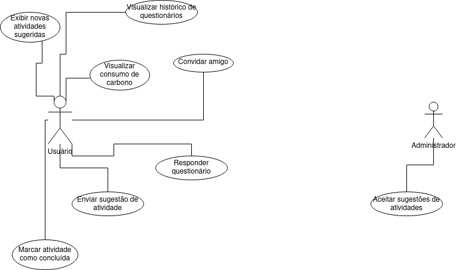

# Especificações do Projeto

## Personas

 

 

## Histórias de Usuários

Com base na análise das personas forma identificadas as seguintes histórias de usuários:

| EU COMO... `PERSONA` | QUERO/PRECISO ... `FUNCIONALIDADE`                               | PARA ... `MOTIVO/VALOR`                                                                               |
| -------------------- | ---------------------------------------------------------------- | ----------------------------------------------------------------------------------------------------- |
| Aline Rodrigues      | Mensurar meu impacto na atmosfera com base no meu estilo de vida | Diminuir o impacto causado                                                                            |
| Marcos Lucas         | Receber sugestões de atividades ecologicamente corretas          | Encontrar atividades que podem substituir as que realizo atualmente ,contribuindo com o meio ambiente |
| Samuel Grgori        | Poder ver a média da pegada de carbono de próximas a mim         | Mobilizar a comunidade ao meu redor a tomar ações de preservação do meio ambiente                     |

## Requisitos

As tabelas que se seguem apresentam os requisitos funcionais e não funcionais que detalham o escopo do projeto.

### Requisitos Funcionais

| ID     | Descrição do Requisito                                                                                                                                                                                                 | Prioridade |
| ------ | ---------------------------------------------------------------------------------------------------------------------------------------------------------------------------------------------------------------------- | ---------- |
| RF-001 | O site deve apresentar, quando no primeiro login do usuário, um questionário sobre o estilo de vida do usuário, incluindo perguntas sobre hábitos de alimentação, transporte, consumo energético, renda, entre outros. | ALTA       |
| RF-002 | O site deve apresentar na página inicial uma checklist personalizada de ações diárias para redução da pegada de carbono do usuário, baseada no questionário inicial.                                                   | ALTA       |
| RF-003 | O site deve permitir que o usuário visualize seus dados inseridos na checklist em datas anteriores.                                                                                                                    | ALTA       |
| RF-004 | O site deve permitir que o usuário refaça o questionário sobre estilo de vida sempre que achar necessário.                                                                                                             | MÉDIA      |
| RF-005 | O site deve permitir que o usuário visualize o seu consumo médio de carbono, calculados a partir do uso do questionário.                                                                                               | MÉDIA      |
| RF-006 | O site deve permitir que o usuário submeta sugestões de ações para redução do consumo de carbono.                                                                                                                      | MÉDIA      |
| RF-007 | O site deve permitir que o usuário compare os seus dados de consumo de carbono e porcentagem de redução/aumento de consumo com a média de todos os usuários da aplicação.                                              | BAIXA      |
| RF-008 | O site deve permitir que o usuário envie convites para amigos utilizarem a aplicação.                                                                                                                                  | BAIXA      |

### Requisitos não Funcionais02-Especificação

| ID      | Descrição do Requisito                                                                                                                                               |
| ------- | -------------------------------------------------------------------------------------------------------------------------------------------------------------------- |
| RNF-001 | O software deve ser implementado como uma aplicação Web.                                                                                                             |
| RNF-002 | Deve ter uma interface fácil e intuitiva para qualquer pessoa conseguir acessar e encontrar.                                                                         |
| RNF-003 | O software deve estar disponível pelo menos 99% das 24hs por dia, 7 dias por semana (24x7), com a possibilidade de paradas pré-programadas para manutenção no mesmo. |
| RNF-004 | O software deve ser compatível com os principais navegadores do mercado (Google Chrome, Firefox, Microsoft Edge)                                                     |
| RNF-005 | Se deve avisar ao usuário caso o software esteja offline e ter uma estimativa de volta.                                                                              |
| RNF-006 | O software deverá apresentar uma interface gráfica no idioma Português – Brasil.                                                                                     |
| RNF-007 | O software deverá ter um meio(e-mail) para que os usuários enviem pedidos de ajuda ou de melhorias, entre outras mensagens.                                          |
| RNF-008 | Todas as informações deverão ser armazenadas em um banco de dados                                                                                                    |
| RNF-009 | O software deverá possuir um bom tempo de resposta para mostrar os dados para o usuário de maneira precisa e eficiente.                                              |
| RNF-010 | O software deverá ser fácil de manter e atualizar assim reduzindo o tempo das manutenções e a sua dificuldade.                                                       |

## Restrições

O projeto está restrito pelos itens apresentados na tabela a seguir.

| ID    | Restrição                                                                                               |
| ----- | ------------------------------------------------------------------------------------------------------- |
| RE-01 | O projeto deverá ser entregue no final do semestre letivo, não podendo extrapolar a data de 05/12/2021. |
| RE-02 | A equipe não pode subcontratar o desenvolvimento do trabalho.                                           |
| RE-03 | O projeto não pode ser compartilhado com terceiros para fins lucrativos.                                |

## Diagrama de Casos de Uso

O diagrama de casos de uso é o próximo passo após a elicitação de requisitos, que utiliza um modelo gráfico e uma tabela com as descrições sucintas dos casos de uso e dos atores. Ele contempla a fronteira do sistema e o detalhamento dos requisitos funcionais com a indicação dos atores, casos de uso e seus relacionamentos.

