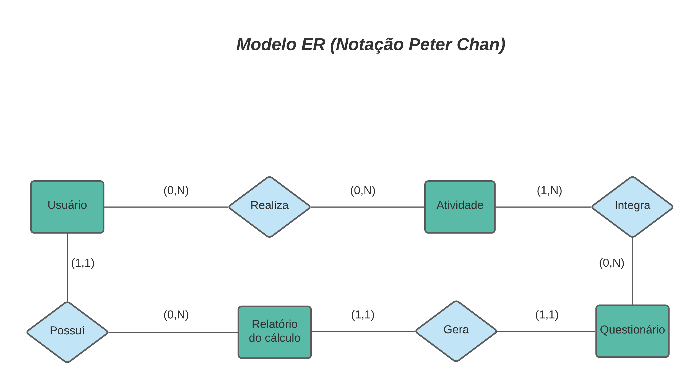
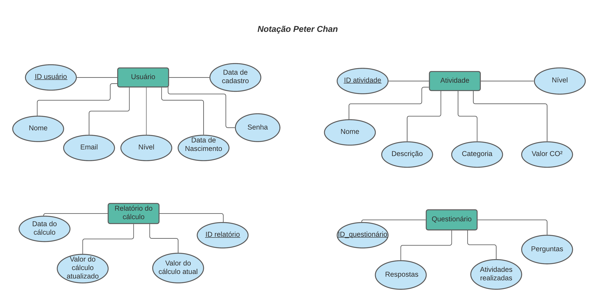

# Arquitetura da Solução

Nesta seção são apresentados os detalhes técnicos da solução criada pela equipe.

## Diagrama de Classes

O diagrama de classes ilustra graficamente como será a estrutura do software, e como cada uma das classes da sua estrutura estarão interligadas. Essas classes servem de modelo para materializar os objetos que executarão na memória.

## Modelo ER

O Modelo ER representa através de um diagrama como as entidades (coisas, objetos) se relacionam entre si na aplicação interativa.

## Esquema Relacional

O Esquema Relacional corresponde à representação dos dados em tabelas juntamente com as restrições de integridade e chave primária.

## Tecnologias Utilizadas

As tecnologias utilizadas para desenvolvimento da aplicação foram as seguintes: Node.Js, mySQL,
Handlebars, Express.JS, HTML, CSS, Javascript.

## Hospedagem

O site utiliza a plataforma do Heroku como ambiente de hospedagem do site do projeto. O site é mantido no ambiente da URL:

https://carbonfree.herokuapp.com/
