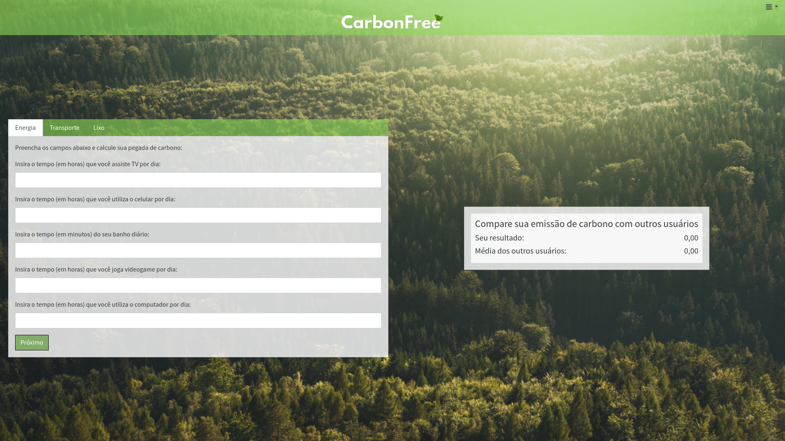
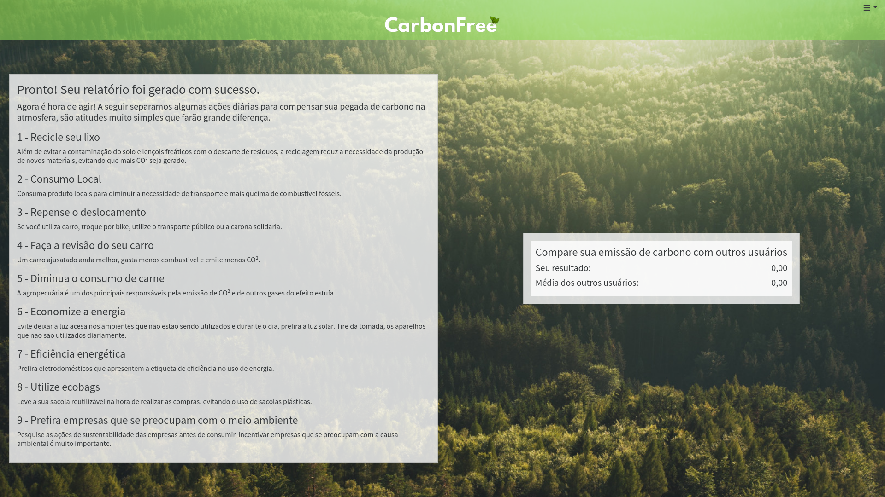
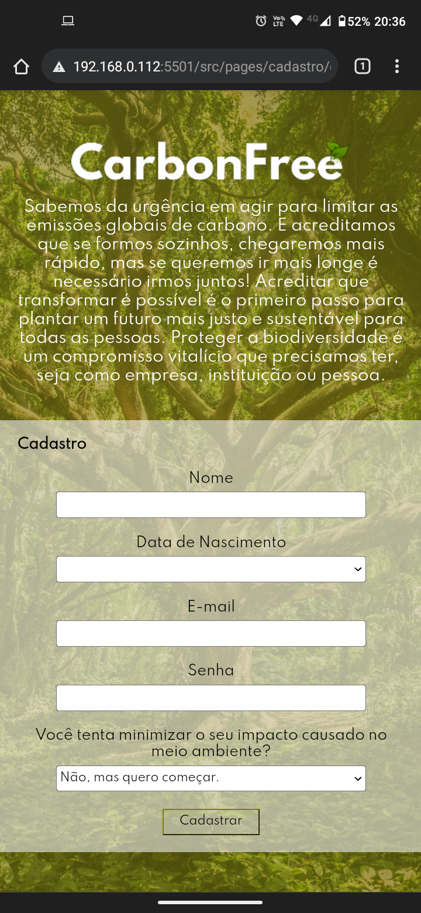
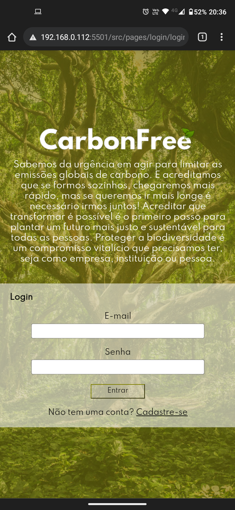
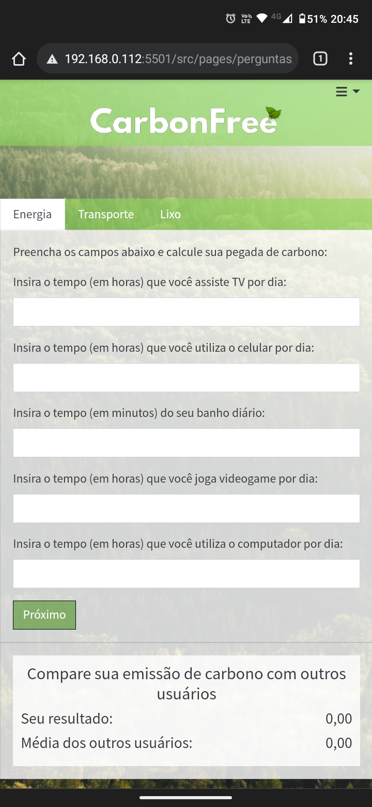
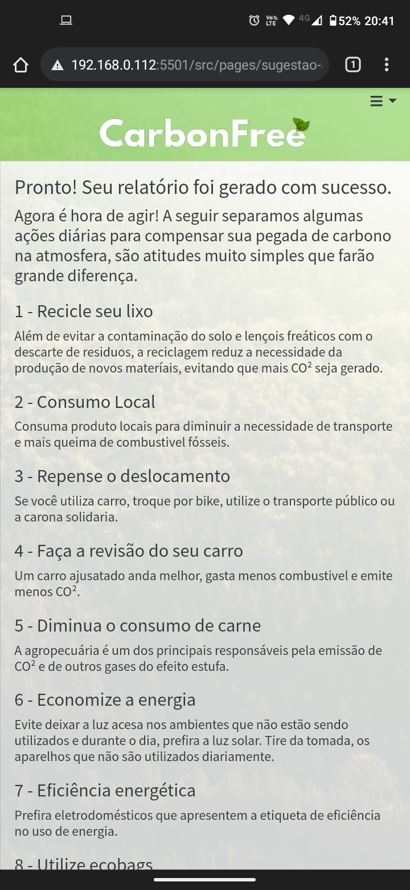
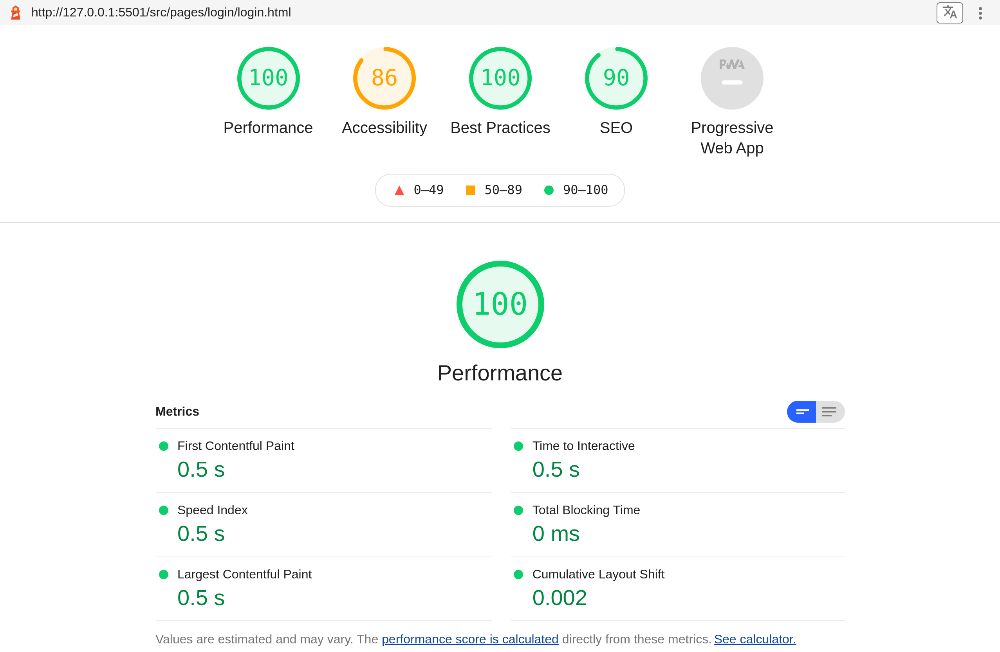
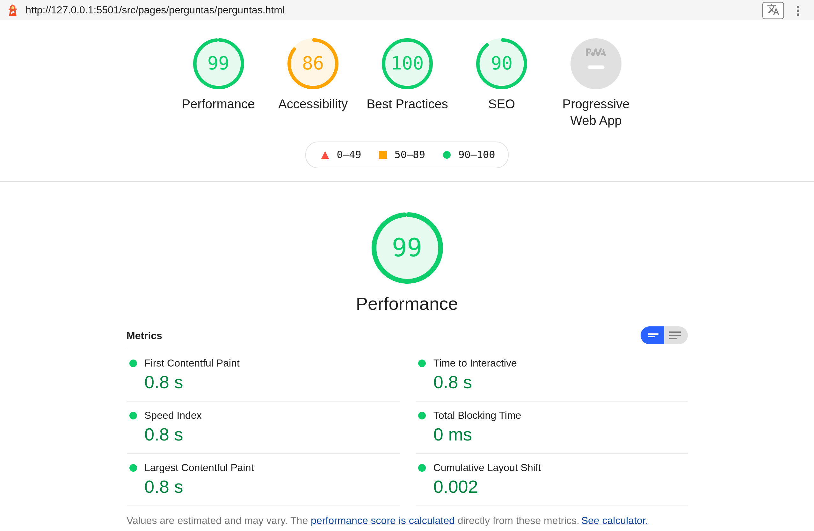
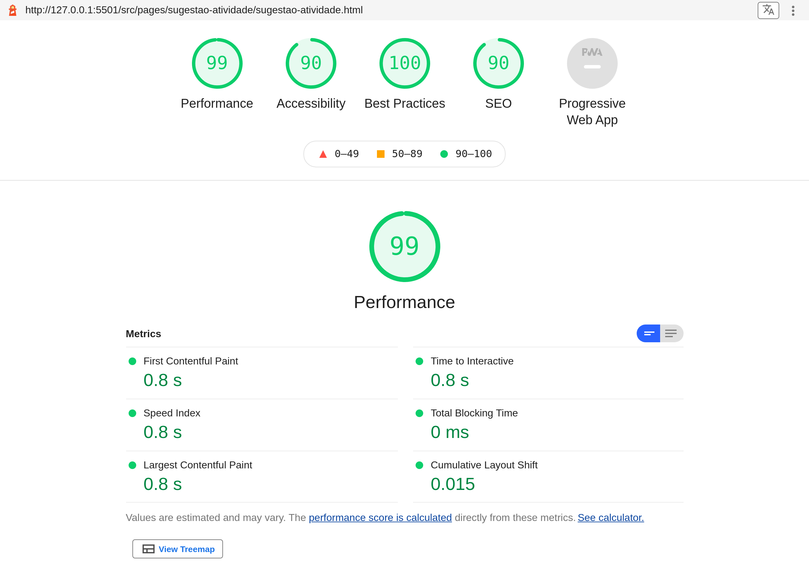

# Registro de Testes de Usabilidade

## CTU-02 Testar a responsividade do site

Conforme prints abaixo, feitos tanto pelo computador quanto pelo smartphone, o site é responsivo.
É possível navegar adequadamente em ambos os dispositivos, tendo acesso a todas funcionalidades.

### Telas desktop

Cadastro

Login

Perguntas

Atividades sugeridas

### Telas mobile

Cadastro

Login

Perguntas

Atividades sugeridas

## CT-04 Avaliar a velocidade geral do site

Conforme relatórios do Lighthouse, disponível no DevTools do Google Chrome, todas as páginas tiveram um tempo de carregamento inferior a um segundo.

Cadastro

Login

Perguntas

Atividades sugeridas

No documento a seguir se encontra o relatório com as perguntas aplicadas aos usuários, no teste de usabilidade.

